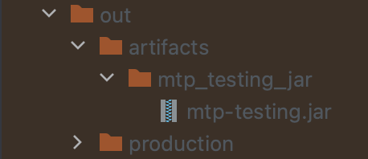

# Setup

> **DISCLAIMER: this project is meant to be run on Linux or macOS machines. Windows is not supported
> due to a scheduler conflict between JPype and Ray.**

## Prerequisites

1. An x86 machine running Linux or macOS (tested on Ubuntu 20.04 and macOS Monterey)
2. A working, clean (i.e new / separate) conda ([miniconda3](https://docs.conda.io/en/latest/miniconda.html)
   or [anaconda3](https://docs.anaconda.com/anaconda/install/)) installation
3. [IntelliJ IDEA](https://www.jetbrains.com/idea/) (CE / Ultimate)

## Installing dependencies

1. Create and activate a new conda environment for python3.8 (`conda create -n mtp python=3.8` & `conda activate mtp`)
2. Navigate to the project root and run `pip install -r requirements.txt`
3. Run `pip install "ray[all]"` to install all dependencies for Ray

## Python Setup

1. In IntelliJ, open the project structure dialogue: `File -> Project Structure`
2. In Modules, select the project and click `Add` and select `Python`
3. In the `Python` tab, add a new Python interpreter by clicking on `...`
4. In the newly opened dialogue, click on `+` and click `Add Python SDK...`
5. In the dialogue, click on `Conda environment` and select the existing environment we created in the previous step
6. Select the newly registered interpreter as the project interpreter and close out of the dialogue after
   clicking `apply`
7. Still in `Project Structure`, navigate to `Modules` and select the project: select the directories `src`
   and `reinforcement_learning` and mark them as `Sources`. Click `Apply` and close out of the dialogue.

## Compiling the project

1. Make sure that the SDK and Language Level in the Project tab are set to 17 (i.e. openjdk-17)
2. Open the Project Structure Dialogue in IntelliJ `File -> Project Structure`
3. Select `Artifacts`
4. Add a JAR file with dependencies
5. Click on the folder icon and select `CF_Translated` in the next dialogue and click OK
6. Click OK again and then in the artifacts overview, in the Output Layout tab, select the Python library and remove it
7. Click on apply and OK
8. Build the artifact: `Build -> Build Artifacts`
9. In `reinforcement_learning/utilities/utilities.py`, make sure that the variable `artifact_directory` is set to the
   folder that contains the compiled artifact. The variable `artifact_file_name` should be set to the name of the jar
   file. (cf. image below: `artifact_directory = mtp_testing_jar` and `artifact_file_name = mtp-testing.jar`)

## Weights & Biases

We used [Weights & Biases](https://wandb.ai/) (wandb) to document our training progress and results. All training files
in this project rely on wandb for logging. For the following you will need a wandb account and your wandb
[API key](https://docs.wandb.ai/quickstart):

1. Create a file named `wandb_key_file` in the `reinforcement_learning` directory
2. Paste your wandb API key in the newly created file
3. In the training files, adjust the wandb configuration to your wandb account (i.e. arguments such as `entity`,
   `project`, and `group` should be modified accordingly)

## Running the project

> DISCLAIMER: the number of bugs used in pretraining, reinforcement learning, and the environment configuration **must**
> be the same.
> To run the individual parts of the final project pipeline, follow the steps outlined below.

> DISCLAIMER: the generation of Pretraining and RL training sets may take some time for *num_bugs > 6* and a large
> number
> of samples.

### Pretraining

#### Pretraining Sample Generation

Run the `reinforcement_learning/dataset_generators > pretraining_dataset_generation.py` script in the terminal or
execute the file in IntelliJ.
The generated dataset(s) will be saved in `data/training_sets/pretraining_training_sets` as different `.pkl` files.
Each training set is identified by the number of bugs and whether multiple_actions are allowed or not. If multiple
actions
are allowed, this means that in the training set there are samples where more then one edge have to be removed from the
CF Matrix.

#### Model Pretraining

Run the `reinforcement_learning/custom_torch_models > rl_network_pretraining.py` script in the terminal or execute
the file in IntelliJ.
The script loads the created training dataset depending on the number of bugs and whether multiple actions are allowed.
After the pretraining, the model is saved in `data/model_weights`.

### Reinforcement Learning (RL)

The RL part of the project is split up into two components: sample generation and training.

#### Reinforcement Learning Sample Generation

To generate RL samples, adjust the number of bugs and number of samples in the main function of
`reinforcement_learning/dataset_generators > rl_trainingset_generation.py` and run the file. The generated training set
will be saved
as a `.pkl` file in `data/training_sets/rl_training_sets`.

#### Reinforcement Learning Training

Reinforcement learning training is done in `reinforcement_learning > train.py`:

1. Set the path to your RL training set from the previous step in `global_config["training_set_path]`
2. If you did generate a pretraining set and did pretrain, also adjust `global_config["pretrained_model_path"]`
3. ***Optional***: if you want to initialise the learner with the pretrained model's weights, set the config parameter
   in `global_config["pretraining"]` to `True`.

### Connect Four

For Connect Four please refer to the [Connect Four](connect-four.md) documentation.
