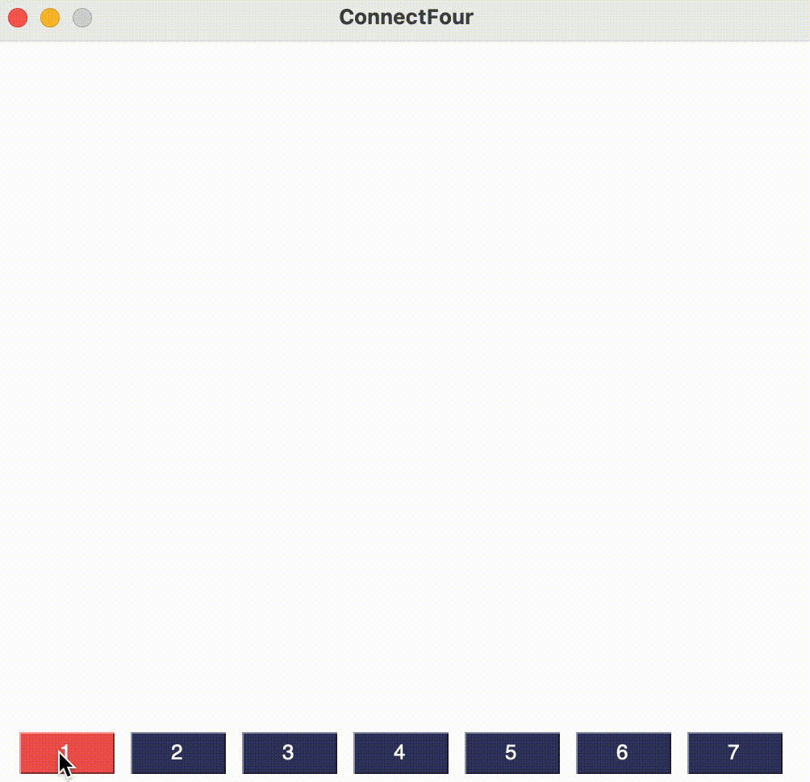

# Connect Four

This file contains the documentation of all components relating to our implementation of Connect Four.

<p align="center">

</p>

## Table of contents

#### 1. [About](#about)

#### 2. [Setup](#setup)

#### 3. [Training](#training)

#### 4. [GUI / Rollout](#gui--rollout)

## About <a name="about"></a>

We implemented Connect Four, a competitive two-player
game [trademarked by HASBRO](https://trademarks.justia.com/730/19/connect-73019915.html), using the
Model-View-Controller (MVC) design pattern as a test piece for our (later)
implementation of Turing Tumble. For this purpose we split our implementation up into two parts:

1. *Java*: logic of the Connect Four game
2. *Python*: openai-gym environment -> wraps the logic and exposes it to RLlib.

To get familiar with RLlib and Reinforcement Learning (RL) in general, we trained an (RL) agent against multiple
rule-based agents. More specifically, we implemented two agents (in Java):

1. *Random agent*: takes random moves
2. *Heuristic/greedy agent*: tries to make the best move (i.e. extend chains) possible while also preventing the RL
   agent from winning (i.e. blocking 4-in-a-row chains).

## Setup <a name="setup"></a>

Create a file called wandb_api_key in the directory `reinforcement_learning` and put your wandb api key in it.
This should allow you to run all scripts related to the Connect Four environment.

## Training <a name="training"></a>

Training is done by running `python reinforcement_learning/connect_four > train_connect_four.py` in the terminal or
executing the file in IntelliJ. The training script will automatically create checkpoints and save them
in `data/agent_checkpoints/connect_four/`.

## GUI / Rollout <a name="gui--rollout"></a>

The GUI can be started by running `connect_four_gui.py`. There are four available game modes. To select one of them
you will need to pass it in as a command-line (CLI) argument.

The program will accept the following arguments:

1. `--humanvsgreedy` (human vs Greedy/Heuristic agent)
2. `--humanvsai` (Human vs AI)
3. `--aivsai` (AI vs AI)
4. `--aivsgreedy` (AI vs Greedy/Heuristic Agent)
5. `--greedyvsgreedy` (Greedy/Heuristic Agent vs Greedy/Heuristic AGent)

The GUI will automatically select the most recent agent checkpoint and load it for the different game modes.

The CLI arguments for the different game modes can be either passed in the terminal:

```shell
python connect_four_gui.py --greedy
```

or by changing the arguments in the IntelliJ `edit run configurations` menu.

