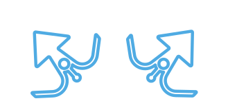
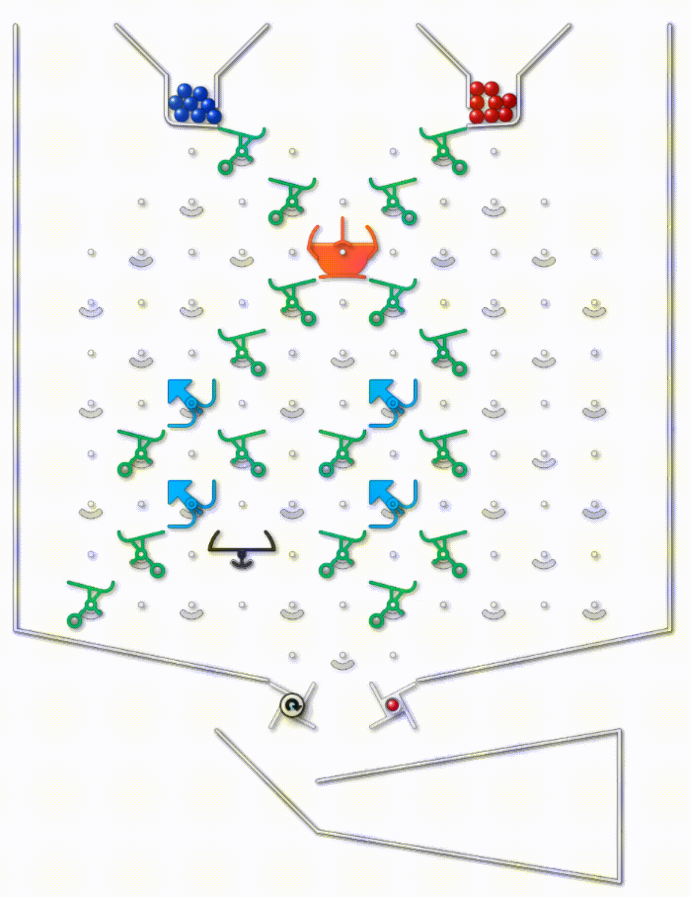
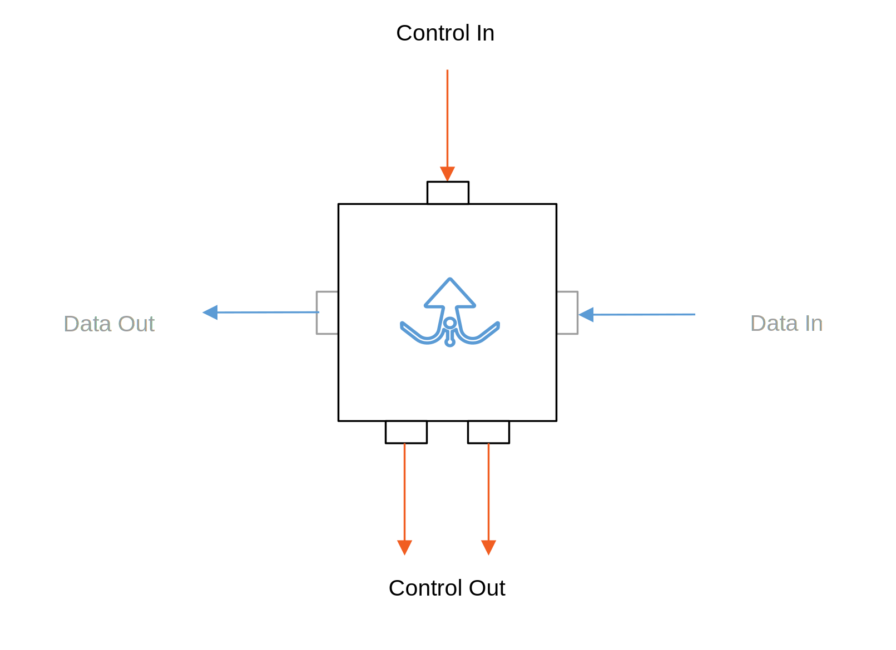
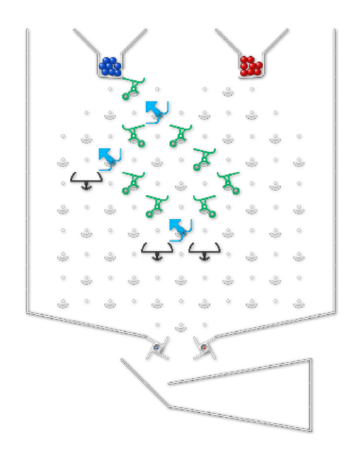
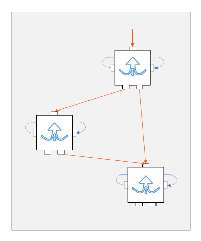
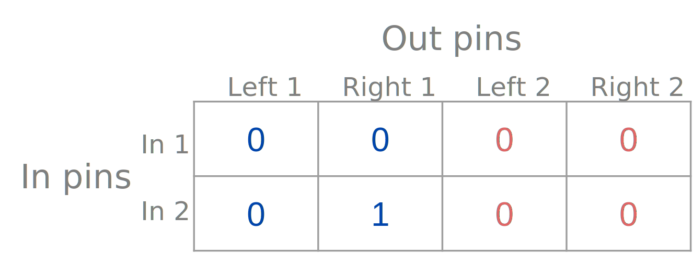
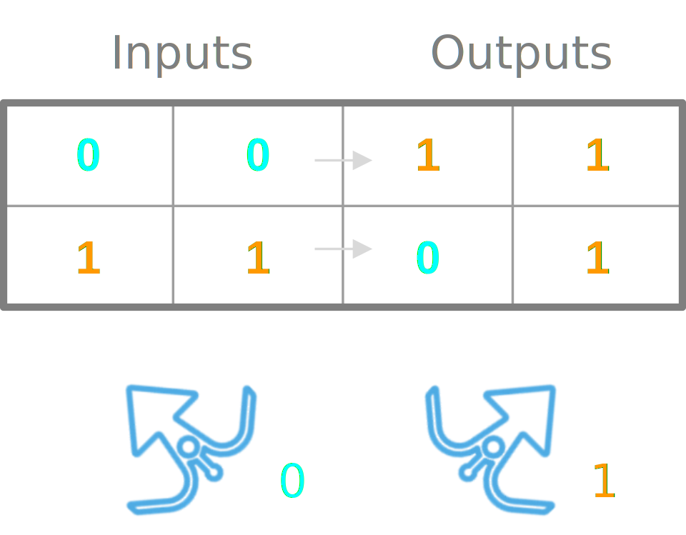
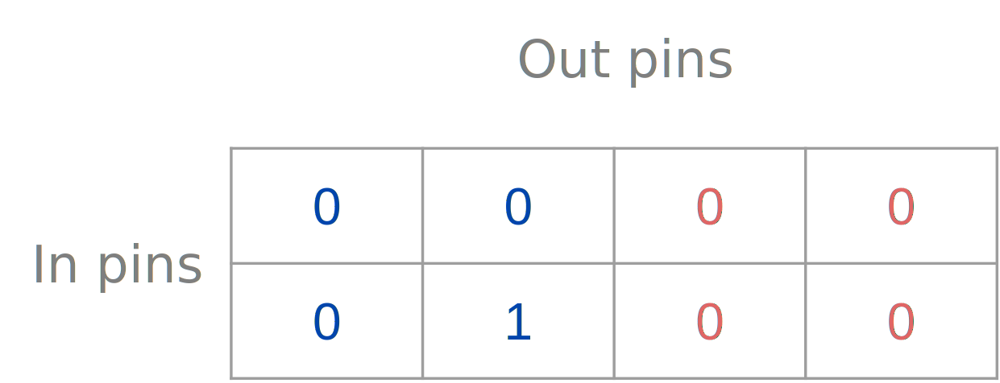
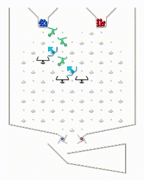

# Turing Tumble Reinforcement Learning

This readme describes all modules related to the Turing Tumble reinforcement learning
part of the project.

## Table of Contents

#### 1. [Introduction](#introduction)

#### 2. [Technical Implementation](#technical-implementation)

#### 3. [Training and Hyperparameter Optimisation](#training--hyperparameter-optimisation)

#### 4. [Data](#data)

#### 5. [Training Set Generation](#training-set-generation)

#### 6. [Callbacks](#callbacks)

#### 7. [Custom Pytorch Models](#custom-pytorch-models)

#### 8. [Utilities](#utilities)

#### 9. [Training Setup](#setup)

#### 10. [Rollout](#rollout)

## 1. Introduction 

Turing Tumble is a game that tests logical thinking and introduces players to the fundamental workings of computers.
The board can be turned into a marble run by attaching different pieces with individual functions on the board.
For our project we limited ourselves to the green, orange, blue, and black pieces.

|                               Path                               | Role                                                                                                                                                     |
|:----------------------------------------------------------------:|----------------------------------------------------------------------------------------------------------------------------------------------------------|
|  | The green edge forwards an incoming marble to the left or to the right side.                                                                             |
|  | The orange edge forwards a marble incoming from the left to the right, and a marble incoming from the right to the left.                                 |
|       | The blue Bit forwards an incoming marble to the left or right, depending on its position. Flips (changes its position) after a marble passes through it. |
|     | The Intercept stops the marble.                                                                                                                          |

### 1.1 Solving Turing Tumble Challenges

The Turing Tumble Puzzle Book contains different kinds of challenges that players have to solve.
The following gif shows a programme, that aims at flipping all four Bits from pointing to the left, to pointing to the
right.

<em>An exemplary challenge</em>

#### The BugBit Environment

BugBit is an abstraction of the Turing Tumble board without restrictions like board size or gravity, devised
by [Dr. Christian Bartelt](https://www.uni-mannheim.de/en/ines/about-us/researchers/dr-christian-bartelt/).
Bugs represent the blue Bits from the physical game.
The orange lines indicate the control flow along the BugBit programme, which equates the flow of the marbles along the
bits on the board.
Each Bug has a control-in pin at its top where the control flow (marble) can come in and two control-out pins at the
bottom, where it can leave.
If a Bug has internal state zero (the blue Bit is flipped to the left) the control flow will leave the Bug via the right
control
out pin.
If it has state one (flipped to the right) the control flow will leave it via the left control-out pin.

<em>An Illustration of a Bug. 
The data-in and -out pin may be ignored, as they are only used internally to flip a Bit’s state after the control flow 
(the marble) passes through it</em>

Different Bugs can now be connected with each other to define more complex programmes.
For example, the following physical Turing Tumble board can be represented by setting the connections
between Bugs as shown below.

 
 

<em>A Turing Tumble Board and its BugBit abstraction</em>

#### The control flow matrix

How the Bugs are connected with each other is stored in the control flow matrix (CF matrix).
Visualised below is a CF matrix for two Bugs. Rows indicate the control-in pins of the Bits,
and columns indicate the control-out pins of the Bits. As each Bit has one control-in pin, but two control-out pins,
we have twice as many columns as rows. If a cell contains a 1 in this matrix, it means that the corresponding in and out
pins are
connected. By setting 1s in the CF matrix we can define a programme, which we can later run.

 

<em>The control flow matrix</em>

#### Reducing the Problem Size

The Turing Tumble Puzzle Book contains all kinds of challenges for the player. So the first step was to define a
specific
subset of the challenges to focus on. For the purpose of this project we limited ourselves to the following problem
class:

1. *We do not allow loops* We treat the board as if the switches at the bottom did not exist, so a challenge has to be
   solved with a single marble.
2. *The waterfall principle* While in the BugBit abstraction gravity does not matter, we only allow Bits’ control flows
   to go into Bits with a higher indication number, i.e. Bits placed
   below them on the physical Turing Tumble board. For example, Bit 1 can only be connected to Bit 2 and 3, Bit 2 can
   only be
   connected to Bit 3, and from Bit 3 the control flow can not go any further.

This limitation reduces the complexity of valid programmes, making the reinforcement learning task more feasible.

#### The Challenge – What the agent learns

The observation space, i.e. what the agent perceives, is comprised of two components: a CF matrix and a specification.
As we reduced the problem size to challenges that follow the waterfall principle, the **CF matrix can indeed only have
non-zero entries in its lower triangular part**. Therefore, we can represent the CF matrix as a vector of length
*n2-n*, where n is the number of Bits.

The specification consists of a set of input-output pairs, describing the Bit positions
(flipped to the left or to the right) before and after the execution of the programme represented by the CF matrix.
The following specification now defines that when we start our programme and both Bits are flipped to the left
(state 0,0), after the programme has completed, they should both be pointing to the right (state 1, 1).
The second row says that when we start our programme with both Bits pointed to the right (state 1, 1), we want the first
Bit to be pointing to the left now (state 0) while the second Bit
stays pointed to the right (state 1) after the programme has finished.

 

<em>A specification: Two input output pairs describing Bit positions before and after running the programme</em>

In summary, the agent is given a **specification and a CF matrix**, which it then has to modify such that the latter
describes a programme which fulfills the former. So a programme, that, if we run
it according to how it is represented in the matrix, will flip the Bits in the way fixed in our specification.

The challenge that was just introduced can be solved by the agent by connecting the first with the second Bit via the
right control-out pin, which results in the following CF matrix:

<em>The control flow  matrix solving the specified challenge</em>

This results in the following Turing Tumble Board which, as can be seen, fulfils the specification.

<em>The solution of the challenge visualised</em>

##                

## 2. Technical Implementation 

#### Openai-Gym Environment

The Turing Tumble Environment is implemented in two parts: The BugBit logic we use to evaluate the agent after each step
is written in Java. It is then wrapped in an openai-gym environment which exposes it to RLlib for the training process.
The resulting environment is registered as
`bugbit-v0`. The basic anatomy of an openai-gym environment is as follows:

1. `__init__()`: Initialise the environment.
2. `reset()`: called at beginning of each episode. Reset the environment to a new state.
   *In our case, sets all entries in the CF matrix, as well as input and output pairs to zero.*
3. `step()`: called at each time step. Return observation, reward, done, info.
   *Lets the agent change one entry in the CF matrix and evaluates the resulting input/output pairs, gives back new CF
   matrix and input/output as observed state, evaluates whether challenge is solved and rewards agent.*

For a more detailed technical description of gym environments, see
the [openai-gym documentation](https://www.gymlibrary.ml/).

#### Reward Function

* -1 for every step taken.
* 10 for winning (i.e. taking an action which produces a control flow matrix that produces the same outputs as the
  target matrix).
* -1 for not completing the game in the predetermined amount of steps.

## 3. Training and Hyperparameter Optimisation 

As the problem space is quite complex and the agent cannot actually observe the BugBit mechanics behind the CF matrix,
we set up a training pipeline consisting of supervised pretraining followed by the actual reinforcement learning part.
By this we hope to give the agent a proper understanding of the environment and speed up learning.

#### Supervised Pretraining

Our neural network has two heads, a policy head and a value head. We pretrain the policy head with expert play in a
classical supervised setting. For this, the network is given a partially-completed CF matrix and a specification (input
and output samples). As output it then produces a vector indicating which element in the CF matrix to manipulate next.
Following the expert play concept, the network is trained to follow a fixed solution algorithm when predicting which
edge to set or delete next. We train the network minimising the KL divergence between the 'ideal' policy vector
following the expert algorithm and the one produced by the network.

It is important to note here that the 'ideal' algorithm is not perfectly efficient. This is where the reinforcement
learning part comes in -- by penalising the agent at each time step, we aim to encourage efficient and creative problem
solving.

#### Reinforcement Learning with Curriculum Learning (CL)

Both the reinforcement learning part and hyperparameter optimisation are performed
with [Ray Tune](https://docs.ray.io/en/latest/tune/index.html) and implemented
in `reinforcement_learning > train.py`.

To gradually have the agent learn how to fulfil a specification by manipulating the CF matrix, the reinforcement
learning environment implements curriculum learning (more specifically: [vanilla CL](https://arxiv.org/abs/2101.10382)).
In our setup, once the agent achieves a certain win-rate threshold on problems of the easiest difficulty (only one entry
in the CF matrix to be changed), the trainer will call `env.increment_phase()` such that all following episodes are now
of the next hardest difficulty (two steps away from a solution). This process repeats as the agent again increases its
win-rate on those now more difficult problems.

#### Hyperparameter Optimisation (HPO)

The [Asynchronous Hyperband Scheduler](https://arxiv.org/abs/1810.05934) is
used as the trial scheduling algorithm and [hyperopt search](http://hyperopt.github.io/hyperopt/) is used to select
suitable trials for HPO.

## 4. Data 

The directory `data` contains training sets and persisted models. The structure is as follows:

| Path                                           | Role                                                             |
|------------------------------------------------|------------------------------------------------------------------|
| `data/agent_checkpoints/`                      | Checkpoints of the RL agents                                     |
| `data/agent_checkpoints/bugbit/`               | Checkpoints of the RL BugBit agent created during training       |
| `data/agent_checkpoints/connect_four/`         | Checkpoints of the RL Connect Four agent created during training |
| `data/model_weights`                           | Weights of pretrained models                                     |
| `data/training_sets/pretraining_training_sets` | Training sets for supervised dataset_generators                  |
| `data/training_sets/rl_training_sets`          | Training sets for RL                                             |

## 5. Training Set Generation 

### 5.1. Generating Pretraining Training Sets

To generate pretraining samples, we first generate Bugbit programmes for ***n*** bits by randomly adding edges between
them subject to the constraint that no loops are allowed. We then generate a full specification for such a programme
by running it for all possible input configurations. Of these ***2n*** input-output pairs, we keep half.
Using
the expert play algorithm 'solver', we generate CF matrices from these incomplete specifications in a stepwise
'waterfall principle' fashion as described in section 1.1. To create the final pretraining samples, we take these CF
matrices and all their
intermediate versions ('timeline') and randomly flip up to three entries in each, thereby adding or removing edges in
the BugBit programme. We generate the target policy vector by identifying which changes need to be reverted to come back
to the original state of the control flow matrix, or to progress in the 'timeline' according to the 'solver' algorithm.

By learning how to delete superfluous edges/add edges which move the state of the CF matrix from one intermediate state
to the next, the agent learns how to 'reflexively' execute the expert play algorithm.

The reason why we only use half of each specification set as inputs to our training is that for the full set, there
exists
only one single correct CF matrix satisfying them. In such a setting, we wouldn't teach the agent creative problem
solving and reinforcement learning would not make sense methodically.

### 5.2. Generating RL Training Sets

To create the reinforcement trainings data set, we first generate random ***n*** bit programmes and their corresponding
full
specification as above. We then randomly keep half of the input-output pairs of the specification. To get training
examples of one to ***m*** steps away from a valid solution, we iteratively add/remove edges from the original
programmes,
that is, we flip entries in the CF matrix. The resulting training set can then be divided into degrees of difficulty by
the maximum 'distance', i.e. amount of steps needed to reach a known solution, which will still fulfill the
specification. Moving up in difficulty during the CL training process will then introduce samples with a larger '
distance' into the RL training process

## 6. Callbacks 

The callbacks are implemented in `reinforcement_learning/callbacks > custom_metric_callbacks.py`. The callbacks are
generally used to log various metrics during training. In our case, we log the win-rate (i.e. how many challenges are
solved within the step-limit) per epoch and then use the callback function `on_train_result()` to increment the phase of
the environment if the win-rate is above the aforementioned threshold. For a more detailed overview of the RLlib
Callbacks API see [RLib Callbacks](https://docs.ray.io/en/latest/_modules/ray/rllib/agents/callbacks.html).

## 7. Custom Pytorch Models 

To train the Reinforcement Learning Agent a custom Pytorch model is used. The model is implemented
in `reinforcement_learning/custom_torch_models > rl_fully_connected_network.py`.
It is a simple fully connected neural network. The number of layers, types of activation functions, etc. can be defined
via a config dictionary as it is done in `train.py` for the Reinforcement Learning and
in `reinforcement_learning/custom_torch_models > rl_network_pretraining.py` for the Pretraining.
As we use a PPO trainer the network consists of two subnetworks: the policy network and the value network.
The policy network is used to select the action to take and the value network is used to estimate the value of the
state.
The custom model implements the **TorchModelV2** and the **torch.nn.Module** module.
For a more detailed description of custom models in RLlib, see
the [Model APIs](https://docs.ray.io/en/latest/rllib/package_ref/models.html).

## 8. Utilities 

The utilities package contains two modules:

1. *utilities.utilities*: exports the paths of important directories to environment variables.
2. *utilities.registration*: registers the environments and custom models with RLlib.

## 9. Training Setup 

A typical training pipeline is as follows:
First of all, the pretraining and the reinforcement learning training sets are generated using both scripts
`reinforcement_learning/dataset_generators > pretraining_dataset_generation.py` and
`reinforcement_learning/dataset_generators > rl_trainingset_generation.py`.

After that, supervised pretraining can be performed
in `reinforcement_learning/custom_torch_models > rl_network_pretraining.py`.
During training, in each epoch the accuracy of the train and test data is computed, showing to which percentage the
agent
chooses a correct action.
Furthermore, every 10 epochs a rollout is performed, where the agent has to solve 100 random challenges from the test
data within at most 50 actions.
The progress of the rollout during the training is also logged.

Finally, in `reinforcement_learning > train.py` the RL agent can be trained on the RL training set using the pretrained
model as an
initialization.

## 10. Rollout 

After the agent has been pretrained or completely trained, rollouts can be performed to have a visualisation of the
actions the agent takes during a challenge.
Therefore, the`reinforcement_learning/custom_torch_models/rl_network_rollout.py` script can be used. The script loads
a specified number of test samples from the test data and performs a rollout with the agent on each test sample.
