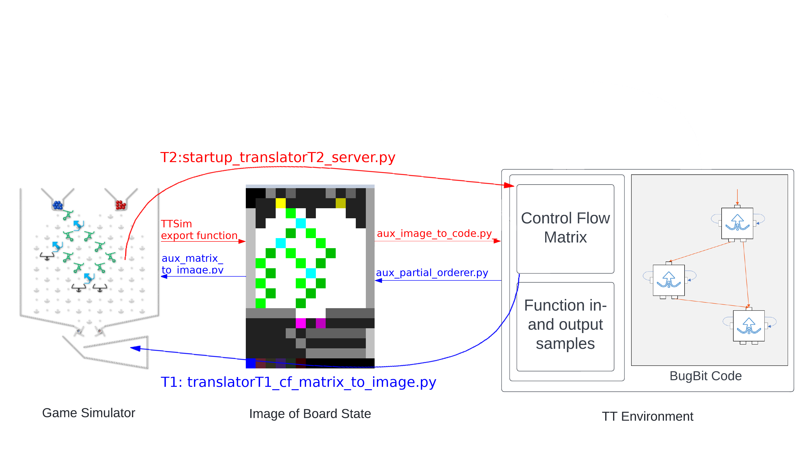

# Translator Modules

This readme describes all 'translator scripts' used in this project.
They can be found in `reinforcement_learning/translators/`

## Contents

1. [Introduction and Motivation](#intro-and-mot)
2. [Constituent Components and Their Functions](#components-and-functions)
3. [Setup and Run Instructions](#setup-and-run)

### 1. Introduction and Motivation 

The translator modules T1 and T2 are the bridges between Jesse Crossen's GUI of the physical Turing Tumble (TT) board
and our internal representation (BugBit) used in the reinforcement learning environment. Thereby, they do not only serve
as a visualisation device for solutions obtained by the agent, but also as a proof of concept: as both challenges and
solutions can be represented as valid physical TT boards, we have demonstrated that our RL pipeline is fundamentally
suitable to teach the agent how to play the actual game.

As illustrated in the schematic above, T1 translates our RL environment's control flow (CF) matrix into a graphical TT
board, whereas T2 translates a board from the GUI into a CF matrix and generates the corresponding executable BugBit
code.

### 2. Constituent Components and Their Functions 

The directory translators contains the translator modules T1 and T2, as well as auxiliary functions and TT templates for
upload to the Jesse Crossen GUI.

| Path                                             | Role                                                                                                                                                                                              |
|--------------------------------------------------|---------------------------------------------------------------------------------------------------------------------------------------------------------------------------------------------------|
| `translators/translatorT1_cf_matrix_to_image.py` | Takes CF matrix and, via an intermediate representation, translates it into TT board with the help of functions in aux_partial_orderer and aux_matrix_to_image.                                   |
| `translators/startup_translatorT2_server.py`     | Starts local server for the Jesse Crossen TT GUI, which the user can then set up and download. Downloaded board is automatically translated into CF matrix and BugBit code via aux_image_to_code. |
| `translators/aux_partial_orderer.py`             | Contains functions for creating the intermediate board representation.                                                                                                                            |
| `translators/aux_matrix_to_image.py`             | Turns the intermediate board representation into a template suitable for upload on the TT GUI server.                                                                                             |
| `translators/aux_image_to_code.py`               | Takes the intermediate representation downloaded from the TT GUI server and translates it into a CF matrix. With the help of the Java Bugbit environment then turns this matrix into BugBit code. |
| `translators/assets/defaultState.png`            | The standard TT board.                                                                                                                                                                            |
| `translators/assets/newDefaultState.png`         | 'Reduced' TT board with only one marble colour. Used in our RL pipeline.                                                                                                                          |

### Setup and Run Instructions  [ADD TUTORIAL VIDEOS HERE??]

#### T1: From Matrix to Board

To visualise a solution obtained by the agent, manually enter the returned CF matrix into the template at the bottom
of `translatorT1_cf_matrix_to_image.py` and run the script.

#### T2: From Board to Matrix

The following scripts should be run locally.
To obtain a control flow matrix from a given physical board, first run `startup_translatorT2_server.py`. This starts up
a local server for the Jesse Crossen TT and opens the GUI in a browser tab. **Upload `newDefaultState.png` via the
GUI's upload button.** Then set up a valid TT board in the GUI. When you are done, click the blank button at the
top-right. This will download the board as a `.json` file, which will then automatically be translated into a control
flow matrix, then into BugBit code, and then executed in jpype. The results of the code's execution will be returned in
the console, the specification in BugPlus code will be written to a file which can be found
under `src/de.bugplus/examples.development > Challenge.java`. 